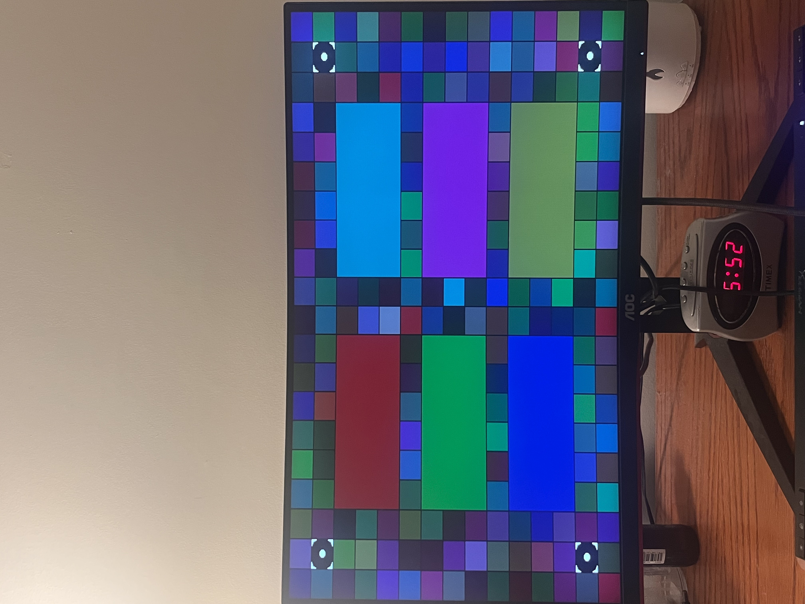

Tang Nano 9K HDMI Output Example

This project implements and successfully runs the example code for HDMI output on the Tang Nano 9K FPGA, originally provided by Sipeed. The goal of this project was to verify and demonstrate proper HDMI signal generation using the FPGA.

Features

Implements HDMI output using the Tang Nano 9K

Based on Sipeed's official example code at https://github.com/sipeed/TangNano-9K-example/tree/main/picotiny/hw/hdmi

Successfully tested and verified on hardware

Requirements

Tang Nano 9K FPGA development board

Gowin IDE (for synthesis and bitstream generation)

HDMI display

HDMI cable

Output

